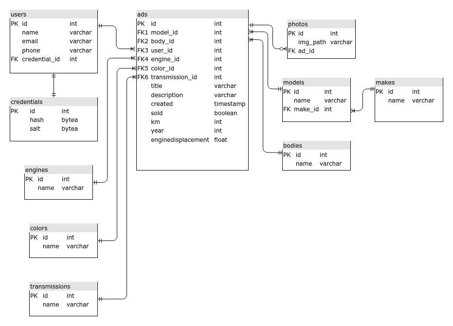

# Only car sales   
  

Сar sales web service. Allows  users to create and search for cars sales ads.  
Stores ads in the DB, and the ads image files on the file system of the server.  

### Technologies:  
- Hibernate (PostgreSQL)
- JAVA servlets/JSTL    
- Bootstrap  
- JS/jQuery  
- Slf4j  
- Travis CI  

### Features  

- User authentication  
- Creating ads      
- Sold status management      
- Filtering ads by parameters

### User interface  
 

 Main page:
  

  

 Filters:
 

   

 User menu:
 

  

 Ads of current user:
 

  

 Page of new ad:
 

  

 Sign up page:
 

 

 Sign in page:
 

  

### DB Schema  

  

### Usage  

Before deploying:
1. Set the "imagesPath" parameter in ./src/main/webapp/WEB-INF/web.xml file.  
   It's a directory where the ads photo will be stored.
2. Set your DB's parameters in ./src/resources/hibernate.cfg.xml.
3. Run scheme.sql on your DB.

Deploy the WAR file to Tomcat:
1. Build the project.
2. Copy the war file to the Tomcat/webapps directory.  
