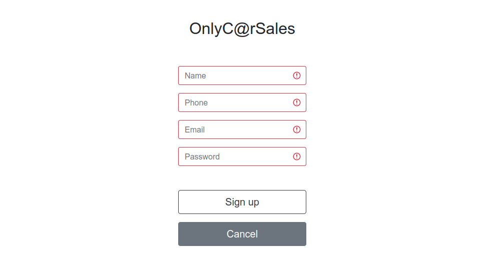

# Only car sales  
  
____ 

This project is created as an example, demonstrating the principles of next technologies:  
- Hibernate  
- PostgreSQL  
- JAVA servlets  
- Bootstrap  
- JS/JQuery  

### Features:
____  
- User's authentication  
- Creating ads  
- Managing ad's sold status  
- Filtering ads 

____ 
### Usage:  
Before deploying:  
1. Set the "imagesPath" parameter in web.xml file.
That's the directory where the ads' files will be stored.  
2. Set your DB's parameters in hibernate.cfg.xml  

Deploy the WAR file to Tomcat:  
1. Build the project
2. Copy the war file to the Tomcat/webapps directory  

### Preview:
____  

 Main page:
  

  

 Filters:
 

   

 User menu:
 

  

 User ads:
 

  

 New ad's page:
 

  

 Sign uppage:
 

 

 Sign in page:
 

  